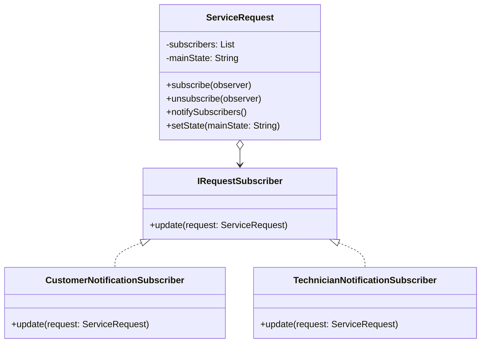

## **Problema 2: Notificaciones automáticas a usuarios y técnicos cuando cambia el estado de una solicitud**

Cuando un cliente realiza una solicitud de servicio, esta pasa por diferentes estados como “Pendiente” (de aceptación), “En progreso”, “Completada”, “Cancelada”, etc. y cada vez que ocurre un cambio, distintos actores deben ser notificados:

- El cliente, para saber si el técnico aceptó o completó la solicitud.
- El técnico, cuando el cliente realiza modificaciones o cancela la solicitud.
- El módulo de reputación, para habilitar la calificación al finalizar el servicio.

El problema concreto es que si `ServiceRequest` tuviera que llamar directamente a todos los módulos/servicios involucrados, el sistema quedaría fuertemente acoplado y agregar un nuevo tipo de notificación (por ejemplo, por WhatsApp o por email) obligaría a modificar la clase central.

El patrón de comportamiento sugerido para solucionar el problema es el **Observer.**

**Por qué resuelve el problema:**

El patrón **Observer** permite que `ServiceRequest` notifique automáticamente a todos los observadores registrados (módulos de notificación a usuarios, reputación, etc.) cada vez que cambia su estado.

Los observadores se suscriben y reaccionan sin que `ServiceRequest` los conozca directamente.

**Participantes en el dominio:**

- Sujeto (observable): `ServiceRequest`
- Interfaz observador: `IRequestSubscriber`
- Observadores concretos:
    - `CustomerNotificationSubscriber`
    - `TechnicianNotificationSubscriber`
    - `ReputationModuleSubscriber`*

**Beneficio:**

Desacopla el núcleo de la lógica de negocio (manejo del estado del servicio) de los módulos que dependen de esos eventos, cumpliendo con los principios **Open/Closed** y **Dependency Inversion**.

### Parte B: Diagrama UML:

**Principios SOLID aplicados:**

- **S (Single Responsibility):** Cada observador tiene una sola función.
- **O (Open/Closed):** Se pueden añadir nuevos observadores sin tocar `ServiceRequest`.
- **D (Dependency Inversion):** `ServiceRequest` depende de la interfaz `IRequestSubscriber`.

### Como correr el codigo: