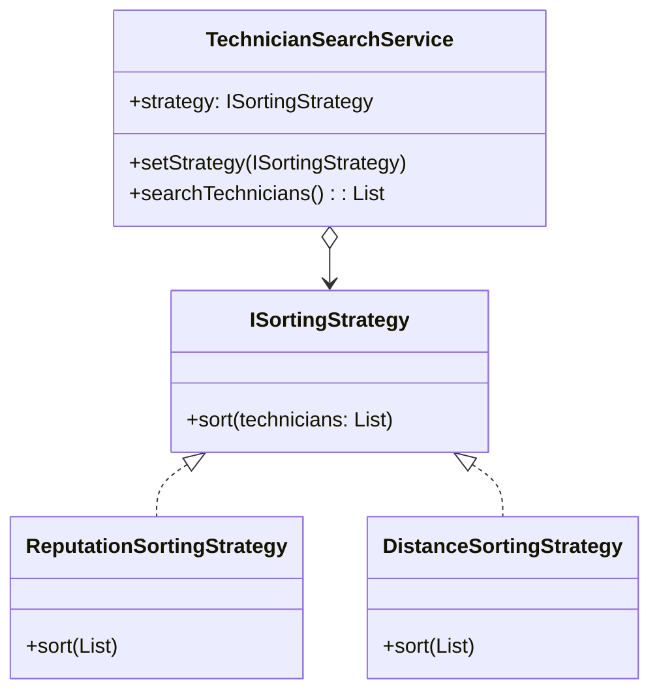

## **Problema 1: Estrategias de filtrado y ordenamiento de técnicos**

Cuando un usuario busca un servicio técnico (por ejemplo, plomería o electricidad), el sistema muestra una lista de técnicos disponibles.

Dependiendo de las preferencias del usuario, la lista puede ordenarse o filtrarse de distintas maneras: Por reputación/calificación y costo estimado del servicio inicialmente, pero debería poder extenderse a otros criterios, por ejemplo distancia o tiempo de respuesta promedio.

Asi las cosas, el sistema necesita poder aplicar distintas estrategias de ordenamiento sin cambiar la lógica principal del módulo de búsqueda y además, debe ser fácil agregar nuevas formas de filtrar (por ejemplo, técnicos certificados o con disponibilidad inmediata).

El patrón de comportamiento sugerido para solucionar el problema es el **Patrón Strategy.**

**Por qué resuelve el problema:**

El patrón **Strategy** permite encapsular cada criterio de ordenamiento en una clase independiente que implementa una misma interfaz.

El módulo de búsqueda (`ProviderSearchService`) puede elegir la estrategia en tiempo de ejecución, según la preferencia del usuario, sin depender de clases concretas.

**Participantes en el dominio:**

- `IFilterStrategy` o `ISortingStrategy` — interfaz común.
- Estrategias concretas:
    - `ReputationSortingStrategy`
    - `CostSortingStrategy`
- Contexto:
    - `ProviderSearchService` — usa una estrategia concreta para mostrar los resultados.

**Beneficio:**

Permite agregar fácilmente nuevos criterios de búsqueda sin modificar el código existente, cumpliendo el principio **Open/Closed** y manteniendo una arquitectura extensible.

### Parte B: Diagrama UML:

**Principios SOLID aplicados:**

- **S (Single Responsibility):** Cada estrategia tiene una única tarea (un criterio de ordenamiento).
- **O (Open/Closed):** Se pueden agregar nuevas estrategias sin tocar el código existente.
- **D (Dependency Inversion):** `TechnicianSearchService` depende de la abstracción `ISortingStrategy`.

### Como correr el código: